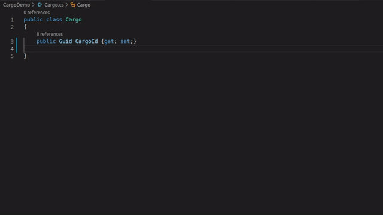
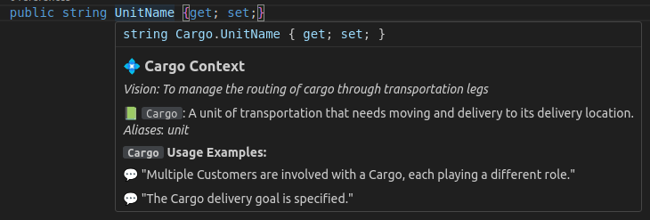
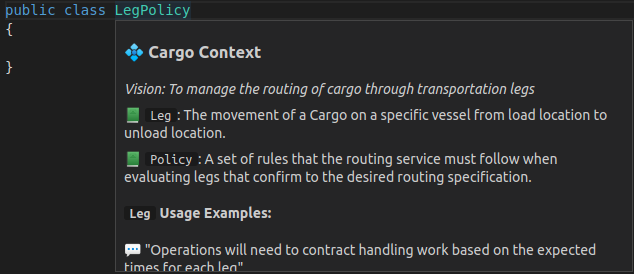

Welcome to the Contextive Usage Guide.

Explore this page to understand how to define your language terms and how to make use of various Contextive features to help users better understand your language in your various contexts.

## Example Domain

In the following sections, examples are drawn from the Cargo domain, as explored by [Eric Evans](https://twitter.com/ericevans0) in his seminal work on DDD - [Domain Driven Design: Tackling Complexity in the Heart of Software](https://www.dddcommunity.org/book/evans_2003/).

The usage examples are quoted or inspired by sample conversations in the book - ideally, your usage examples should be exact sentences as said by your domain experts.

The following Contextive definitions file was used to generate all screenshots/scenarios below:

```
contexts:
  - name: Cargo
    domainVisionStatement: To manage the routing of cargo through transportation legs
    paths:
    - CargoDemo
    terms:
    - name: Cargo
      definition: A unit of transportation that needs moving and delivery to its delivery location.
      examples:
        - Multiple Customers are involved with a Cargo, each playing a different role.
        - The Cargo delivery goal is specified.
      aliases:
        - unit
    - name: Leg
      definition: The movement of a Cargo on a specific vessel from load location to unload location.
      examples:
        - Operations will need to contract handling work based on the expected times for each leg
        - For each leg we'd like to see the vessel voyage, the load and unload location, and time.
    - name: Policy
      definition: |
        A set of rules that the routing service must follow
        when evaluating legs that confirm to the desired routing specification.
      examples:
        - We need to configure the set of policies that will apply for a specific customer.
    - name: Leg Magnitude Policy
      definition: A policy that helps the routing engine select the legs with the lowest magnitude.
      examples:
        - The leg magnitude policy is selecting the fastest leg, but we need it to select the cheapest leg.
    - name: Vessel
  - name: Billing
    domainVisionStatement: Compute and levy charges for shipping
    paths:
    - BillingDemo
    terms:
    - name: Policy
      definition: A set of payment rules that defines when invoices are due, and actions to take when unpaid.
      examples:
        - The billing policy is to send to collections after 90 days in arrears.
```

The screenshots are from VsCode, but it should look similar in any IDE.

## Combined Words

For the hover display, Contextive is able to identify the use of defined terms in combined words - where terms are combined using `camelCase`, `PascalCase` or `snake_case`, or defined terms that _are_ combined words.

### Suffixes and Prefixes

It's quite common to combine a term from your language, such as `cargo` with a suffix such as `Id` (or `service`, or `factory`, etc.).  If your code includes `cargoId`, `CargoId` or `cargo_id`, Contextive will identify the defined term `cargo` and display the definition and usage examples:


### Combining two (or more) terms

It's also common to end up with code elements (classes, variables or methods) that combine two or more terms from your language, such as `Leg` and `Policy`.  Even if you haven't explicitly created a term for `LegPolicy`, Contextive will identify both words and show you both definitions at the same time:



### Multi-word terms

Sometimes, the combined term needs its own unique definition - just add it to your definitions file, and Contextive will work out that the more precise match is the one you want, decluttering your hover panel.  

It can be added to your definitions file as either separate words (e.g. `Leg Magnitude Policy`) or as `PascalCase` or `camelCase` (e.g. `LegMagnitudePolicy`).  Either way, once it's defined, the definitions of `Leg` and `Policy` will no longer be shown:


This also now works for `snake_case` code:


## Plural Words

Contextive can detect a defined term even when it is defined in the singular and used in the plural.

Coming Soon: Ability to detect a defined term when it is defined in the plural and used in the singular, and when individual words in a multi-word term are pluralised or singularised.

## Term Aliases

Contextive supports defining a list of aliases for a given term.  These can be acronyms or just alternative words that are sometimes used interchangeably.  For example, in the cargo domain above, `unit` is an alias of `cargo`.

When hovering over the word `unit`, the definition of `cargo` will be displayed:



## Multiline YAML

As some of the fields in the definitions file could have long text, it may be helpful to use multi-line yaml. Because the fields are interpreted as markdown, there are some special considerations to be aware of.  The site https://yaml-multiline.info/ is a great resource for multi-line yaml fields.

The following common scenarios are more fully explored in the [multiline sample file](https://github.com/dev-cycles/contextive/blob/main/src/vscode/contextive/test/single-root/fixtures/simple_workspace/.contextive/multiline.yml) and apply to all fields, but are most likely useful for the `domainVisionStatement`, `terms.definition` and `terms.examples` fields.

### Multiline with Line Break

If a definition (or domain vision statement) is quite long, and you would like to include linebreaks (but not new paragraphs), you need to use one of the yaml multi-line options that ensures at least one newline is parsed, AND to render a markdown linebreak you need to add two `<SPACE>` characters at the end of the line:

```yaml
contexts:
  - name: Demo Multiline Options
    terms:
      - name: LiteralLineBreak
        definition: |
          This definition has multiple lines with a linebreak  
          achieved using the literal block indicator, a single newline, and two spaces at the end of the first line
```

Renders to:


### Multiline with New Paragraph

To achieve a new paragraph, use a yaml option that parses multiple newlines, e.g.:

```yaml
contexts:
  - name: Demo Multiline Options
    terms:
      - name: LiteralNewParagraph
        definition: |
          This definition has multiple paragraphs

          achieved using the literal block indicator and two newlines
```

Renders to:


### Multiline in No Newline in Hover

Sometimes you may want to break over multiple lines to make it easier to read the raw yaml, but don't want the newlines to appear in the hover.  In this case, just don't use any Markdown linebreak or new para features.  e.g.:

```yaml
contexts:
  - name: Demo Multiline Options
      - name: LiteralMultilineNoBreak
        definition: |
          This definition has no break in the hover panel
          Even though it's over multiple lines, because there are neither 2 spaces (linebreak) nor two newlines (new paragraph)
```

Renders to:


The line will still wrap according to the width of the hover panel.

## Smart Auto-Complete

As the terms added to the auto-complete are from a definitions file, not from your code symbols, the auto-complete will work in any file of any language - including documentation, such as markdown.

To ensure it's useful in a variety of scenarios, it includes a number of options to fit your required format:

* camelCase
* PascalCase
* snake_case
* UPPER_CASE

The auto-complete options will adjust as you type - e.g. after typing a single lower-case letter, only `camelCase` and `snake_case` will be included.  After typing a single upper case letter, `PascalCase` and `UPPER_CASE` will be included.  After typing two upper case letters, single word, snake_case and combined words will all be in `UPPERCASE`.


## Repository Organisation

Contextive is designed to work with a variety of repository organisation schemes:

### Single Bounded Context, Multiple Repositories

When a single context is comprised of services, each with their own repository, it's not ideal to have to maintain a copy of the context's language definitions in each repository.

To facilitate this pattern, Contextive recommends storing the terms only once, in a central/common repository, and using native package management facilities to distribute the definitions file as part of any common code packages.

For package managers that store the packages within the workspace, simply set `contextive.path` to the relative path of the downloaded package.  For package managers that store the packages in a global cache, Contextive allows the `contextive.path` setting to contain a shell escape code - `$(cmd)`. When `$(` is detected in the path setting, Contextive will execute `echo "%contextive.path%"` and use the result to `stdout` as the location of the definitions file.

See https://github.com/dev-cycles/contextive-demo-go-service for an example of this in action using `golang` packages.


### Multiple Bounded Contexts, Repository per Context

This is the simplest option - all you need to do is define the terms for that context in the relevant repository.

### Multiple Bounded Contexts, Single Repository, Single-Root (Monorepo)

For projects utilising a [monorepo](https://en.wikipedia.org/wiki/Monorepo) it's not uncommon to have code relating to multiple [bounded contexts](https://martinfowler.com/bliki/BoundedContext.html) in the same repository.  At this time, Contextive tracks all definitions in the same file.  Each context has a `paths` property that defines a list of path [globs](https://en.wikipedia.org/wiki/Glob_(programming)).  When working on a file, any context with a matching path glob will be evaluated when finding matches for hover and auto-complete.

This is particularly helpful if the same term (e.g. a common term, like `client`, or `invoice`) is used in multiple contexts.  The definition in each context can relate specifically to its usage in that context.

Each context has optional properties `name` and `domainVisionStatement`.  When set, these names and vision statements will be included in the hover panel.

Given the definitions file above, and a folder structure like so:

```
/CargoDemo
  /LegPolicy.cs
/BillingDemo
  /Policy.cs
```

Contextive will match the files to the path glob configurations.

When hovering over `CargoDemo/LegPolicy.cs` we get:



When hovering over `BillingDemo/Policy.cs` we get:


### Multiple Bounded Contexts, Multi-Root, Shared Definitions File

Some IDEs support a [multi-root workspace](https://microsoft.github.io/language-server-protocol/specifications/lsp/3.17/specification/#workspace_workspaceFolders) configuration which allows separate folders to be selected as 'roots' of a workspace. 

So far, Contextive only supports this under ALL the following circumstances:

1. You are using the VsCode IDE in a [Multi-Root](https://code.visualstudio.com/docs/editor/multi-root-workspaces) configuration AND
2. The definitions/terminology for all roots are in a shared file (Support for separate files per root is a future enhancement) AND
3. The value for the `contextive.path` configuration parameter is explicitly provided in the `settings` key of the `.code-workspaces` file  

The reason is that the Contextive definitions file location defaults to the relative path `.contextive/definitions.yml`.  This default is defined in the language server (to ensure consistency across IDEs). In a single-root configuration it's clear what base path it is relative to, but with multi-root it's ambiguous as to which root the path is relative to.

To resolve this, custom VsCode middleware rewrites the setting to an absolute path computed relative to the folder of the `.code-workspaces`, however this only works if VsCode is aware of the setting value to be re-written.

:::caution[Breaking Change] 
In the initial support for multi-root workspaces, the default value was defined in the VsCode extension, so the path rewrite worked on this default value and an explicit setting was not required.

With the removal of the vscode default value, this no longer works and an explicit value is required in the `settings` key in the `.code-workspaces` file.

If you are using the default location, please set this value to `.contextive/definitions.yml`, e.g. your `.code-workspaces` file should have:

```
{
   "settings": {
     "contextive.path": ".contextive/definitions.yml"
   }  
}
```
:::

Also note that the `paths` key in the Contextive definitions file relates to the paths of the roots on disk, not to their names in the vscode multi-root configuration.

If you'd like to store the definitions file in a different location, update the setting in the `.code-workspaces` file.

If you need multi-root support in another IDE, please raise a [github issue](https://github.com/dev-cycles/contextive/issues/new?assignees=&labels=&projects=&template=feature_request.md&title=)!